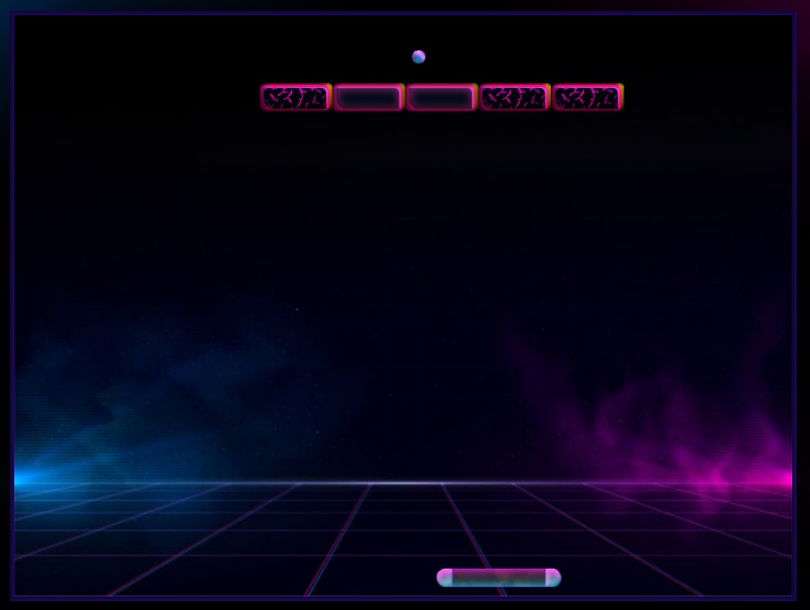
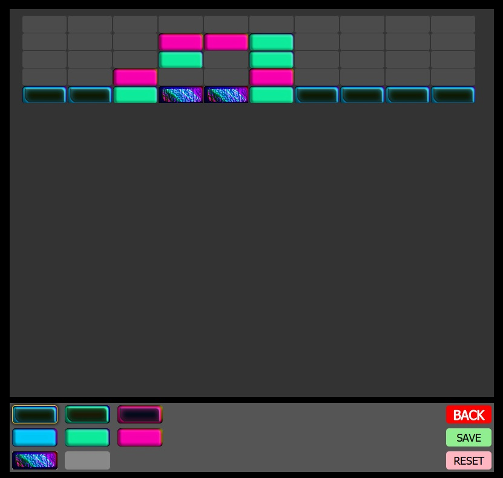

# simpleArkanoid [WIP]

Un simple arkanoid clone, hecho con Phaser (framework para crear juegos) que fue uno de los primeros juegos que hice con javascript.
También se pueden crear niveles, jugarlos y guardarlos!

Todavía no esta deployado pero se puede ejecutar con: ``npm start``

## Algunas imágenes:

